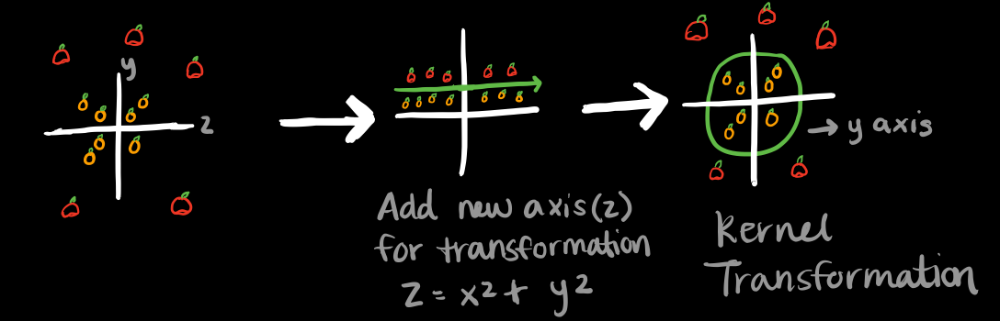
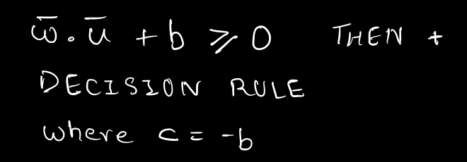
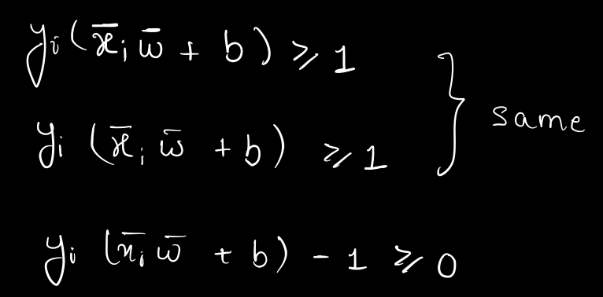

# SVM_Tutorial
Data Mining Course Project

An Introduction To The World Of Support Vector Machines

Imagine it's Thanksgiving Day and you are joined at the dinner table with all of your family. As you feast on Turkey and delicious Pumpkin pie, the topic of discussion at the table is centered around SVM. However, some of the relatives at the dinner table are quite confused as to what SVM even stands for. Now it is your job to explain to the confused relatives at the table what SVM is. You will start off with the most confused relative (great-grandmother) and make your way up to the relative that knows the most about SVM (daughter)

Lets start off with sweet great-grandmother Ann.

**Great-Grandmother Ann:** You keep talking about something called SVM. What in the world does that mean hon?

**You:** Great-Granny, SVM stands for support vector machine. It is a technique used in machine learning to create decision boundaries in order to classify features as belonging to different classes. Lets say you have apples and oranges and you want to classify all the apples into one class and classify all the oranges as belonging to a different class. We can use SVM to make sure that all the apples and oranges get put in the correct category.

**Grandmother Sarah:** Wow, this technique is really applicable to lots of cases but how do we classify the oranges and apples into different classes?

**You:** Well grandma, what SVM does is, that it creates a separation line called the hyperplane which separate outs the different classes. In our case, we draw the hyperplane in such a way that it would separate the apples from the oranges. In the end, we want the optimal hyperplane that maximizes our ability to separate out the different classes and classify with high accuracy.

(You arrange the apples and oranges on the dinner table and put a stick between them to show the separation.)

**Mother:** That sounds fairly simple but I am sure there are more complex examples of things that need to be classified. What if there are examples where we cannot simply just draw a line and have the classes be divided?

**You:** You are absolutely correct mom. There are many examples in which it is hard to simply draw a straight line and divide the classes. In reality most data is randomly distributed. In such cases, you have to apply transformations to the features and these transformations are referred to as kernels. This allows us work with and separate non-linear data. This can be better visualized with the image below. 

**Husband:** Honey, I have another question for you. How do you deal with overlap between data points? How do we decide where to draw the line in this case?

**You:** Great question sweetheart! First of all, lets give a formal name to the line. The line that separates the classes is known as the decision boundary. Now, coming to your question. There are situations where we cannot get perfect classification such as when there is an overlap of data as you mentioned. In situations like these, tuning parameters come into play. In SVM, we have two main tuning parameters: regularization and gamma. Regularization works in that it calculates and tells the SVM how much to avoid misclassifying each of the training samples. There are two approaches, either we draw a decision boundary that has some points misclassified into the wrong class or we draw a decision boundary that results in zero misclassified points by having a perfect partition. There are trade-offs involved if you choose either technique. If a high regularization value is given, then the SVM optimizer will choose to have some misclassified points in the data, which can lead to misclassificatin of some data points into the wrong class. If a low regularization value is given, then the SVM optimizer will choose to have perfect partitioning and will try its best to have no misclassified points, leading to minimization in misclassification. Therefore, regularization is not a one fits all solution and can vary based on the dataset. 

**You:** We can also look at the gamma parameter. The gamma parameter defines how far the influence of a single training sample reaches. When gamma values are low, we calculate where the separation decision boundary should be using points farthest away from the probable separation decision boundary. A low gamma value would indicate that the data points are sparse. When gamma values are high, we calculate where the separation decision boundary should be using points closest to the probable separation decision boundary.

**You:** Once we tune our parameters, the last thing we can look at is the margin. The margin is the distance of the closest data points from the separation line, which would be the hyperplane. When we define the optimal hyperplane, we are essentially maximazing the margin. A good margin is equidistant as far as possible from the different classes.Once we achieve all this, we should have high accuracy and low misclassification.

h&theta;(x) = &theta;o x + &theta;1x

**Daughter:** Very nice Mom! I think I see that having widest possible separation between the samples of classes can yield a good classifier but I am curious how would we make a decision rule mathematically that would use this decision boundary? 

**You:** Brilliant question honey. This will require us to use some pencil and paper for the derivations. How about we do it after this yummy dinner?

**Daughter:** Sounds good.

(After the dinner you and your daughter resume the discussion.)

**You:** Let's say we want to classify two classes(positives and negatives). Our goal is to derive the decision boundary in such a way that it separates these two classes in widest possible way. Let's call this separation a street which has gutters at the edges running parallel to it and we want to maximize the width of this street.  

Now, imagine a vector w of any length you like constrained to be perpendicular to the median line or the gutter line of the street. We don't know anything about its length yet. Then we also have some unknown u. And we have a vector that points to it by excel as shown below. 

To be able to classify that unknown into one of the two classes, what we would really be interested in is whether that unknown is on the right side of the street or on the left side of the street. So what we want to do is we want to project that vector u down on to one that’s perpendicular to the street. With this we will have the distance in this direction of w. And, the further ought we go the closer we will get to being on the right side of the street(right from the median line). So we can take u and dot it with w, and measure whether or not that number is equal to or greater than some constant. 

Remember the dot product has taken the projection on the w. And the bigger that projection is the further out along this line, the projection will lie. And eventually it will be so big that the projection crosses the median line of the street and we will say it must be a positive sample. Or we can say without loss of generality, that the dot product, plus some constant b is equal to or greater than zero. If that's true, then it's a positive sample. So that's our decision rule.

The trouble now is we don't know what constant to use. And we don't know which w to use either. We know that w has to be perpendicular to the median line to the street but there are lots of w's that are perpendicular to the median line because it can be of any length.So we don't have enough constraint here to fix a particular b or a particular w. So, next we're going to lay on some additional constraints on the situation so that we can actually calculate calculate b and w. If we take the dot product of w with some positive sample and we have b just like our decision rule, we are going to want that to be equal to or greater than 1. Likewise, if we dot w with some negative sample then that has to be equal to or less than minus one. 

To make things simpler we can reduce these two equations to one by introducing a new variable y_i such that y_i is equal to plus one, for positive samples and minus one for negative. Then we multiply both equations with $y_i$. In the case of negative samples multiplication with a -1 flips the inequality and both the equations become same.

 

Now, let me bring that one over to the left side making it equal to or greater than zero. 

 

For the samples in the gutter it's going to be exactly zero.

 

Okay we have some equations now. But let’s not forget what are we actually trying to do. We're trying to figure out how to arrange for the line to be such that the street, separating the pluses from the minuses as wide as possible. So what's the width of the street? We don’t know it yet but let’s define few vectors as shown below:

If we have a unit normal to the median line of the street, taking the dot product of the difference vector with that unit normal will give us the width of the street.

But if you remember we said that that w is a normal to the median line. So we can multiply the difference vector with the w and divide by the magnitude of w to make it a unit vector. So that product is in fact a scalar, and it's the width of the street.

Substituting x positive dot w with 1-b from the equation that constrains the samples that lie in the gutter. Similarly x negative dot w will be substituted with -(1+b). This gives the width of the street as 2 over the magnitude of w. And what we're trying to do? We're trying to maximize that. So we want to maximize 2 over the magnitude of w. That means that it's okay to drop the constant and minimize the W. For mathematical convenience let’s minimize one half magnitude of w squared which is same as minimizing w.

Now we have an expression that we would like to find the minimum of. Also we have got some constraints that we would like to honor. Lagrange multipliers can be helpful here. If we want to find the extremum of a function with constraints then using lagrange multipliers gives us a new expression, which we can maximize or minimize without thinking about the constraints anymore. Hence our new equations that we want to minimize without any constraints is:

Where alpha sub i is the multiplier for each constraint. Note that the right term is equal to zero. Hence adding it to w squared does not affect it. To find the minimum of this equation we got to find it’s derivatives and set them to zero.

Partial of L with respect to w gives following equation:

Note that this is a differentiation with respect to a vector. This tells us that vector w is a linear sum of some of the samples. Some because alpha sub i is zero for some samples. It is only non zero for samples in the gutter. 

Now differentiating L with respect to b gives:

Now plugging the value of w back in L we get, 

Simplifying the equations gives:

Note that the optimization depends only on the dot product of the pairs of samples.

Now putting the w back into the decision rule gives:

Note that the decision rule also depends only on the dot product of the vectors and the unknown.

Notice that in the case of negative samples multiplication with a -1 flips the inequality. If you look at the equations carefully, oops, both the equations are the same. 

Now, let me bring that one over to the left side making it equal to or greater than zero. For the samples in the gutter it's going to be exactly zero.

Okay we have some equations now. But let’s not forget what are we actually trying to do. We're trying to figure out how to arrange for the line to be such that the street, separating the pluses from the minuses as wide as possible.

So what's the width of the street? We don’t know it yet but let’s define few vectors as shown below:

If we have a unit normal to the median line of the street, taking the dot product of the difference vector with that unit normal will give us the width of the street.

But If you remember we said that that w is a normal to the median line. So we can multiply the difference vector with the w and divide by the magnitude of w to make it a unit vector. So that product is in fact a scalar, and it's the width of the street.

Substituting x positive dot w with 1-b from the equation that constrains the samples that lie in the gutter. Similarly x negative dot w will be substituted with -(1+b)

This gives the width of the street as 2 over the magnitude of w. And what we're trying to do. We're trying to maximize that right. So we want to maximize to over the magnitude of w. Alright, so that means that it's okay to maximize one over w instead. Just drop the constant and that means that it's okay to minimize the W.

And for mathematical convenience let’s minimize one half magnitude of w squared which is same as minimizing w.

Now we have an expression here that we would like to find the minimum of extreme of. Also we have got some constraints here that we would like to honor.

We learned in 1802 that if we find the extreme of a function with constraints that we're going to have to use lagrange multipliers. That will give us a new expression, which we can maximize or minimize without thinking about the constraints anymore.

Hence our new equations that we want to maximize without any constraints is:

Where alpha sub i is the multiplier for each constraint. Note that the right term is equal to zero. Hence adding it to w squared does not affect it. 

To find the maximum of this equation we got to find it’s derivatives and set them to zero.

Partial of L with respect to w gives following equation:
Note that this is a differentiation with respect to a vector.

This tells us that vector w is a linear sum of some of the samples. Some because alpha sub i is zero for some samples. It is only non zero for samples in the gutter. 

Now differentiating L with respect to b gives:

Now plugging the value of w back in L we get, 

Simplifying the equations gives:

Note that the optimization depends only on the dot product of the pairs of samples.

Now putting the w back into the decision rule gives:

Note that the decision rule also depends only on the dot product of the vectors and the unknown.

